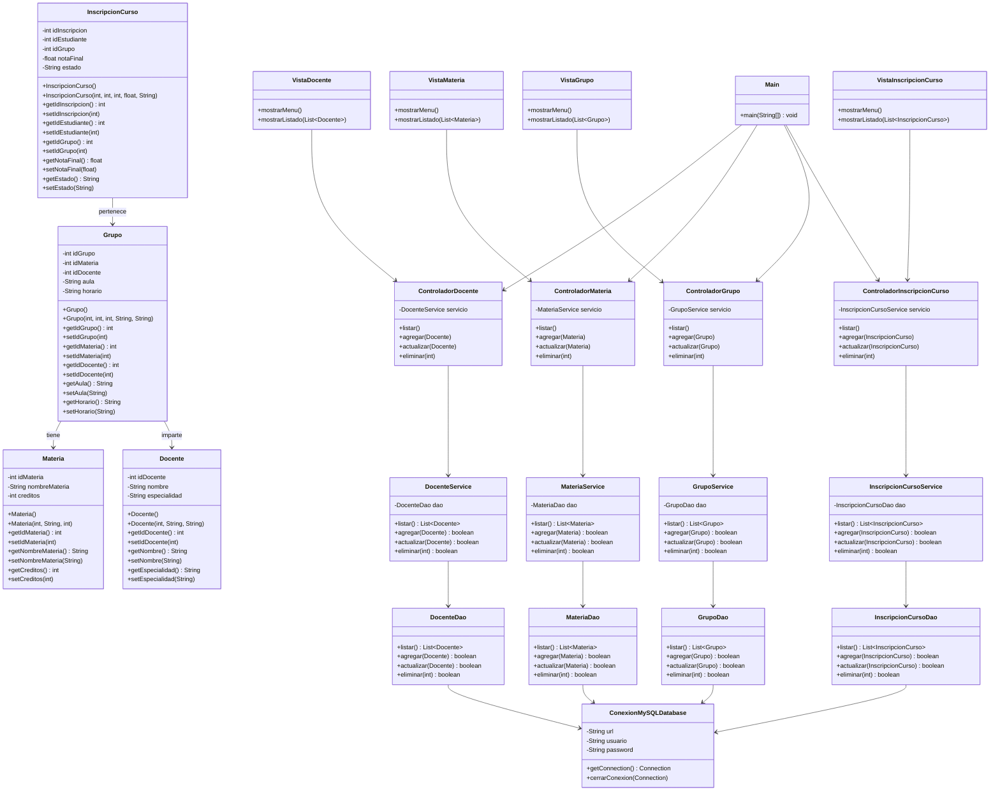

# Taller Práctico - Sistema de Gestión Académica

## Diagrama de Clases



## Estructura del Proyecto

| Paquete | Descripción |
|---------|-------------|
| **modelo** | Entidades del sistema: Docente, Materia, Grupo, InscripcionCurso |
| **dao** | Acceso a datos: operaciones CRUD con MySQL |
| **servicio** | Lógica de negocio intermedia |
| **controlador** | Coordinación entre vista y servicio |
| **vista** | Interfaz de usuario (menú y listado) |
| **config** | Conexión a la base de datos MySQL |

## Arquitectura

El proyecto sigue el patrón **MVC (Modelo-Vista-Controlador)** con una capa de servicios intermedia:

```
Vista → Controlador → Servicio → DAO → Modelo
```

## Tecnologías

- **Lenguaje**: Java
- **Base de datos**: MySQL
- **Build tool**: Maven

